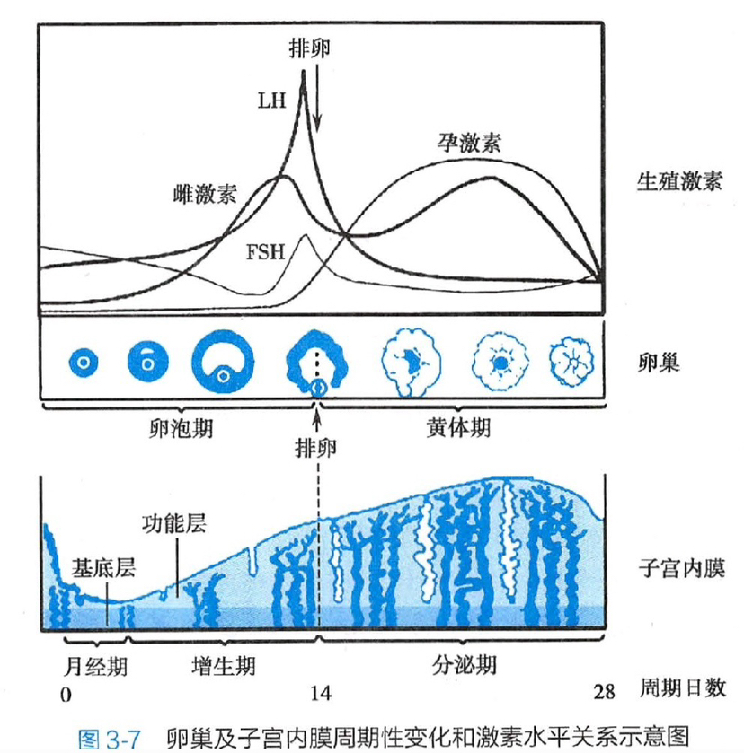

# 第三章 女性生殖系统生理

女性青春期最早出现的是**乳房发育**。

排卵后**7~8天**黄体体积和功能达到高峰，若卵子未受精，黄体在排卵后**9~10日**开始退化，组织纤维化成为白体，14日完全结束。

胆固醇合成雌激素、孕激素和雄激素，所以他们属于**类固醇激素**，而FSH、LH及hCG都是**糖蛋白激素**，前两者由腺垂体的促性腺激素细胞分泌，hCG由合体滋养层细胞分泌。

雌激素在**肝内**代谢：所以肝硬化的蜘蛛痣为雌激素不能被灭活造成。

雌激素E2活性大于E3，但评价胎盘功能一般用E3：E1老妇，E2少妇，E3孕妇。

### 卵巢及子宫内膜周期性变化和激素水平关系示意图

### 雌激素的生理作用

1. 促进子宫发育
1. 使子宫内膜腺体和间质增生、修复
1. 使宫颈口松弛扩张，宫颈粘液分泌增加，性状变稀薄，富有弹性，易拉丝
1. 促进输卵管发育及上皮的分泌活动，并可加强输卵管肌节律性收缩的振幅
1. 使阴道上皮细胞增生和角化，粘膜变厚，并增加细胞内糖原含量，使阴道维持酸性环境
1. 促进外生殖器和第二性征的发育
1. 协同促卵泡刺激素促进卵泡发育
1. 通过对下丘脑和水体的正反馈调节，控制促性腺激素的分泌
1. 促进骨中钙的沉积，加快骨的成熟和骨骺愈合
1. 促进水钠潴留
1. 促进肝脏高密度脂蛋白的合成，抑制低密度脂蛋白的合成，降低循环中胆固醇水平

一切**增生**与雌激素有关，一切**分泌**与孕激素有关。

卵巢性激素以胆固醇为原料的合成途径：孕激素 -> 雄激素 -> 雌激素

雌激素**两个高峰**，排卵前和排卵后，排卵前来源于**卵泡壁细胞**，排卵后来源于**黄体**，  
孕激素仅有排卵后**一个高峰**，来源于**黄体**，  
卵泡刺激素（FSH）和黄体生成素（LH）都有**促进卵泡发育**的功能，所以都仅有排卵前**一个峰**。

### 雌激素与孕激素的比较

类别|雌激素|孕激素
--|--|--
子宫|1. 提高子宫平滑肌对缩宫素的敏感性 2. 对子宫内膜有增生作用 3. 促进宫颈黏液分次增多，性状变稀薄|1. 降低子宫对缩宫素的敏感性 2. 使增生期的子宫内膜进入到分泌期 3. 抑制宫颈黏液分泌，性状变粘稠
输卵管|加强输卵管节律性收缩|抑制输卵管的收缩
阴道|促使阴道上皮增生和角化|促使阴道上皮脱落
乳腺|使乳腺管增生，乳晕、乳头着色|使乳腺腺泡发育
水和钠|促进水钠潴留|促进水钠排泄
其他|促进卵泡发育，使宫颈口松弛|使子宫肌肉松弛，使排卵后基础体温升高0.3~0.5°C
来源|排卵前：卵泡膜细胞和颗粒细胞 排卵后：黄体细胞|排卵前：颗粒细胞 排卵后：黄体细胞 妊娠后：合体滋养细胞

> 雌激素造成的改变是为了受精，孕激素造成的改变是为了保胎和生产。

能直接调控卵巢的周期性变化是**促卵泡刺激细胞**和**黄体生成素**的共同作用。

雌激素促进**乳腺腺管**发育  
孕激素促进**乳腺腺泡**发育，乳头增大变黑、乳晕颜色加深  
催乳素促进乳腺腺泡**分泌**

但大量的雌、孕激素抑制了乳汁的生成，故妊娠晚期**无乳汁分泌现象**。

初乳是妊娠末期，尤其在接近分娩期，挤压乳房时出现的**少量淡黄色稀薄液体**。

### 基础体温图

身体状态|高温相
--|--
正常|12天左右
黄体功能不全|小于10天
黄体萎缩不全|大于14天，且呈缓坡下降
无排卵|0天
考虑妊娠|大于14天，且维持高水平
怀疑流产|大于14天，维持在高水平突然下降，形成一个陡坡

### 无周期变化的组织

1. 卵巢生发上皮：虽然每次排卵都会被顶破，但不会恢复！（像一个莲蓬）
1. 卵巢髓质
1. 子宫内膜基底层

### 月经周期

第1天——月经周期开始  
第5天——增殖早期开始  
第8天——增殖中期开始  
第11天——增殖晚期开始  
第15天——分泌早期开始：形成**糖原小泡**，间质水肿  
第20天——分泌中期开始：**顶浆分泌**，间质高度水肿  
第24天——分泌晚期开始：**有糖原分泌/溢出**，间质疏松水肿/肿大

> 整体开始时间记为手机号 158-1115-2024

### 雌激素的正反馈

垂体释放FSH（促卵泡生成素） -> 促进卵泡发育 -> 卵泡膜细胞释放雌激素 -> 促进垂体释放FSH

导致排卵最直接的原因是：**LH（黄体生成素）最高峰**

月经来潮的原因是：**血中雌激素、孕激素**水平都**降低**（撤退出血）

宫颈黏液中的蛋白质、糖和某些电解质相结合，于涂片干燥后出现结晶，雌激素**促进羊齿状结晶形成**，孕激素抑制其形成，黏液分泌量逐渐减少，使质地黏稠而浑浊，涂片检查时结晶逐渐模糊，至月经周期第22日左右完全消失，代之以排列成行的**椭圆体**，孕激素 -> 椭圆体。

催乳素促进乳汁**合成**  
催产素促进乳汁**排出**  
卵泡刺激素促进卵泡成熟  
黄体生成素促进排卵

月经周期长短取决于**增生期**长短，因为分泌期是比较固定的14天。

受精多在排卵后的数小时内发生，一般**不超过24小时**，结合部位在**输卵管壶腹部**。

受精成功第**6~7天**为着床，着床后即为妊娠的开始。

受精后前8周称为胚胎，**第9周**起称为胎儿。

成熟卵子**受精**是妊娠的开始！！

受孕周数 = 受精周数 = 妊娠周数 - 2周

妊娠全过程约280天，即40周。

胎盘由属于胎儿部分的**羊膜**、**叶状绒毛膜**以及属于母体部分的**底褪膜**组成。

故底褪膜的作用是**构成胎盘母体面**，胎盘的功能是**排泄胎儿代谢产物**、**合成激素和酶**、**产生孕激素**。

孕妇在妊娠**8~10周**时血清hCG浓度达到高峰。

合体滋养细胞产生：hCG、hPL、孕激素、宫缩素酶  
胎儿胎盘单位产生：雌激素

叶状绒毛膜分两层，内层为细胞滋养层细胞，外层为**合体滋养层细胞**，hCG即为外层分泌。

### 胎儿营养物质交换方式

物质|交换方式
--|--
钠钾镁、脂溶性维生素、游离脂肪酸、水、氧气及二氧化碳|简单扩散
葡萄糖|异化扩散，胎儿代谢的主要能源
氨基酸、钙磷铁碘|主动转运

### 妊娠期羊水来源

时期|来源
--|--
早期|母亲血清经胎膜进入羊膜腔的透析液
中期|胎尿
晚期|胎肺分泌物

脐带表面有羊膜覆盖呈灰白色，内有**两条脐动脉**，共同环绕**一条脐静脉**。

### 妊娠期雌、孕激素来源

激素|小于10周|大于10周
--|--|--
雌激素|黄体|胎儿-胎盘单位
孕激素|黄体|合体滋养细胞

### 妊娠期羊水量变化

周数|羊水量（mL）
--|--
8周|5~10
10周|30
20周|400
38周|1000（最多）
40周|800（足月）
42周|300（过期）

### 妊娠期各系统变化

- 生殖系统
  - 阴道皱襞增多，伸展性增加
  - 卵巢排卵，新卵泡发育均停止
  - 子宫各部增长速度：宫底增长最快，宫颈最少
  - 12周，子宫峡部逐渐变软、伸长、变薄，扩展为宫腔的一部分，临产后伸展至7~10cm，成为软产道的一部分，称为**子宫下段**，是产科手术学的重要解剖结构。*注：并不是在妊娠晚期才开始变软延长！！*
  - 宫颈管黏液增多，形成黏稠黏液栓
- 循环系统
  - 心脏叩诊浊音界增大，心脏向左前上方移位，心尖搏动左移1~2cm
  - 闻及收缩期柔和吹风样杂音——因回心血量增加导致的相对二尖瓣闭合不全
  - 心率增快而有心悸，于妊娠晚期休息时每分钟增加10~15次
  - 收缩压变化不大，舒张压减小，脉压增大
  - 心脏容量至妊娠末期约增加**10%**
  - 左侧卧位心排量增加约**30%**，至妊娠**32~34周**达高峰
  - 血容量增加**40%**
  - 妊娠晚期仰卧位时增大的子宫压迫下腔静脉，回心血量减少、心排出量减少使血压下降，称仰卧位低血压综合征
